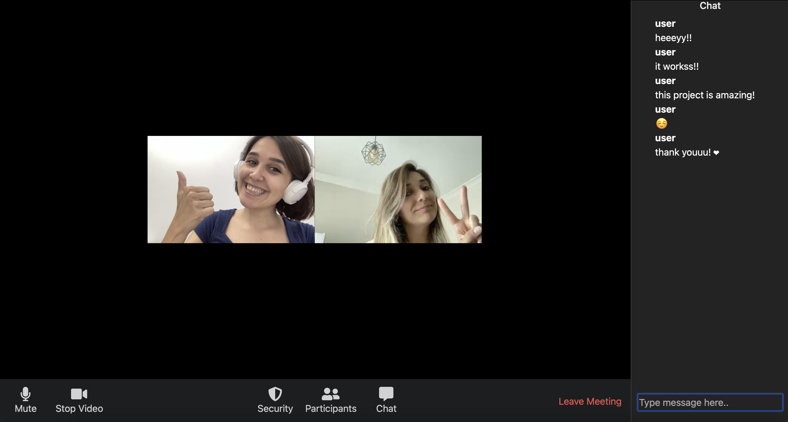

# Zoom Clone with Node JS👥

A small web app, Zoom clone made using Node JS.
Click demo to try it by yourself!

## Zoom Clone Demo Link

To start a conversation with your friends [Click Me](https://warm-peak-12177.herokuapp.com/4f42fd17-bad3-4040-b750-015f61a5d66c)

## Topics
- Initialize our NodeJS Project 
- Initialize our first view
- Create a room id 
- Add the ability to view our own Video 
- Add the ability to allow others to stream their video
- Add styling
- Add the ability to create mesages
- Add mute button
- Add Stop Video button

 
